# Reshell（This project is able to passby mainstream av such as HuoRong,windowsdefender,lenove security manager and so on.You can continue with donut for your own payload!!!）

A **Go-based** C2 (Command & Control) lab platform: a single process provides a **Web admin panel**, **TCP listener**, **payload download + one-click launch scripts**.  
Agents are written in **C/C++** (Windows / Linux amd64). Callback parameters are injected via **binary stub patching (C2EMBED1)**.  
When generating payloads, **no local g++ invocation is required**.

(If you encounter bugs, please open issues. The project will be improved incrementally.)

---

## Development Intent

1. **Architecture learning**: understand layered C2 design in controlled environments — management plane (HTTP + JWT + embedded frontend), browser real-time channel (WebSocket), data plane (TCP listener + custom protocol), and payload pipeline ("template PE/ELF + config block patching").
2. **Authorized security testing only**: use only on **owned devices**, **lab targets**, or systems with **written authorization**. Unauthorized use is illegal. This project does not provide or encourage such behavior.
3. **Reproducible and easy deployment**: server depends on **pure Go + embedded SQLite** (`glebarez/sqlite`, default `CGO_ENABLED=0`), suitable for single-binary deployment.

---

## Run From Scratch After Clone (Required Reading)

Follow these steps to open the panel locally.  
You can start the service **without preparing stubs first** (login and UI still work).

| Step | Action |
|------|------|
| 1 | Install **Go 1.21+** (`go version` to verify). |
| 2 | Enter the **repository root** (must contain `go.mod` and `config.yaml`). |
| 3 | Download dependencies: `go mod download` |
| 4 | Edit **`config.yaml`**: at minimum update `auth.login_password` and `auth.jwt_secret` (do not use weak defaults in production). |
| 5 | Start: `go run ./cmd/server` or build first with `go build -trimpath -ldflags="-s -w" -o c2-server.exe ./cmd/server`, then run the executable. |
| 6 | Open the address from **`server.addr` in `config.yaml`** (commonly `http://127.0.0.1:8080` or `http://localhost:8080`; if set to `:8080`, it listens on all interfaces). |
| 7 | Log in using your configured **`login_password`**. |

**Common startup failures:**

- `load config failed` / `read config`: current working directory does **not** contain `config.yaml`. `cd` to the correct directory or place `config.yaml` there.
- Port already in use: change `server.addr` or stop the process using that port.

---

## Stub Templates (Payload Generation / One-Click Download)

These features require prebuilt templates containing **C2EMBED1** magic bytes.  
If stubs are missing, the service can still run, but **payload generation** and **exe/elf download triggered by connect commands** will fail.

| File (relative to `data/stubs/`) | Purpose |
|---------------------------|------|
| `windows_x64.exe` | Windows x64 payload |
| `windows_x86.exe` | Windows x86 payload (not fully developed in this version, but Windows-compatible source is provided; you may compile it yourself using mingw32) |
| `linux_amd64.elf` | Linux amd64 payload |

Lookup order (summary): env var **`C2_STUB_DIR`** → `data/stubs` beside executable → `data/stubs` under current working directory.  
You can also build with **`go build -tags=stubembed`** to embed templates (see `internal/payload/stub_embed_on.go`).  
Template source is under **`client/native/`**, and can be used with scripts in **`scripts/`** plus local toolchains.

---

## First Listener and Initial Callback (Quick Guide)

1. In **Listener Management**, create a new listener: set **listen address** (e.g. `0.0.0.0:4444`) and **public connect address** (used by agents, typically `IP:port` or domain).
2. Click **Start** for that listener and ensure status becomes **online**.
3. Click **Connect Command**: sidebar shows single-line commands (PowerShell / Linux / certutil / mshta, etc.). Copy and run on target environment.
4. For public deployments or when panel runs on localhost but target is remote: set **`server.public_host`** in `config.yaml` to a target-reachable IP/domain (do not use `0.0.0.0`), otherwise generated HTTP addresses may still point to `127.0.0.1`.

---

## UI Preview

The following images are located in repository **`pic/`** (`1.png` … `13.png`).  
When browsing `README.md` on **GitHub / Gitee**, relative-path images load automatically.

### 1. Dashboard

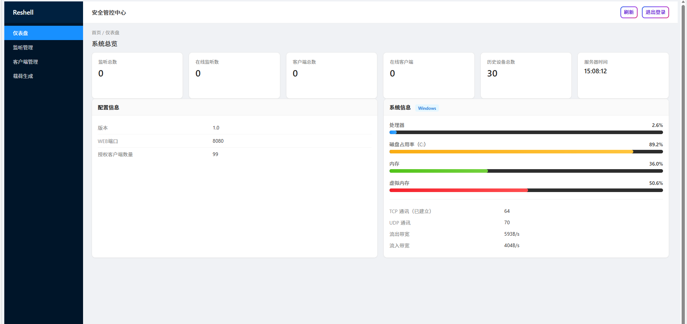

- **Security Control Center / Dashboard**: listener and client stats, historical device counts, server time.
- **Configuration Info**: version, web port, etc.
- **Local Resource Usage**: CPU, memory, disk, virtual memory, network overview.

### 2. Listener Management — Create Listener

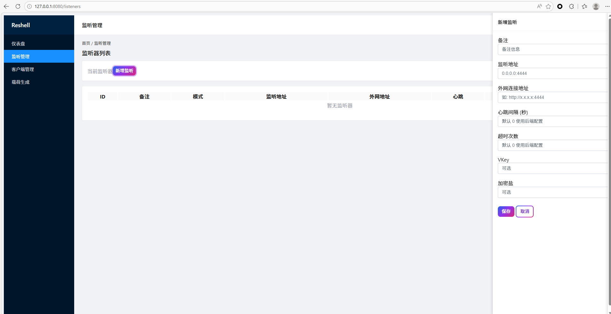

- Open **Listener Management** and click **Create Listener**.
- Fill **listen address**, **public connect address**, heartbeat, and optional **VKey / encryption salt**.

### 3. Listener Management — Connect Commands (Single-Line)

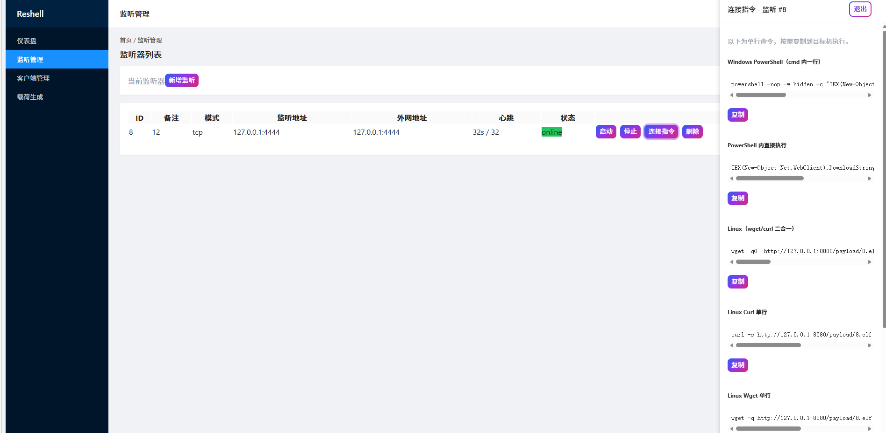

- After listener is **online**, click **Connect Commands** to copy one-line bootstrap commands for **Windows / Linux** (PowerShell, curl, wget, certutil, mshta, etc.).
- Close via **Exit** or **×**.

### 4. Payload Generation — Configuration

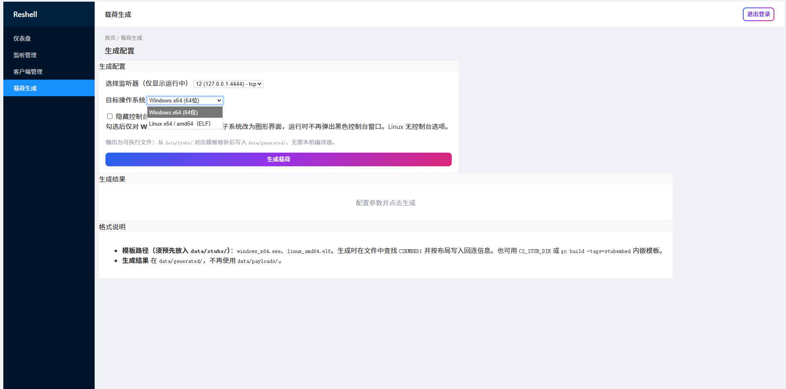

- Select **listener** and **target OS** (Windows x64 / Linux amd64).
- Windows supports optional **hide console** (PE subsystem set to GUI).
- Notes indicate patching templates from `data/stubs/` and output to `data/generated/`.

### 5. Payload Generation — Success and Download

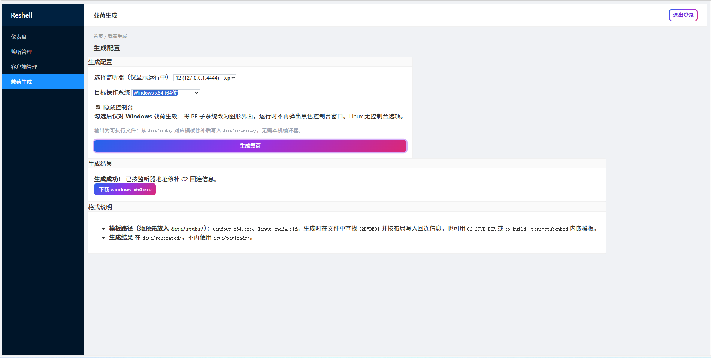

- After clicking **Generate Payload**, download the patched executable from the result area.

### 6. Client Management — List and Real-Time Notifications

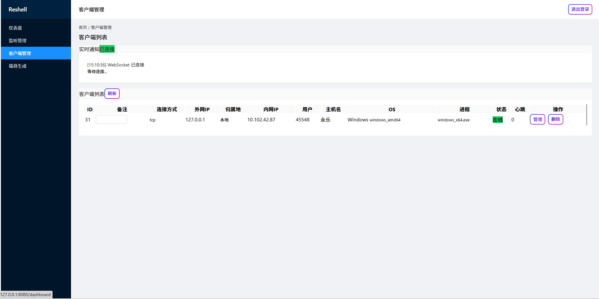

- **Real-time notifications** are delivered via WebSocket.
- **Client list** displays public/private IP, geolocation, user, hostname, OS, process, online state, etc.; supports **Manage** and **Delete**.

### 7. Device Details — System Info and Feature Entry

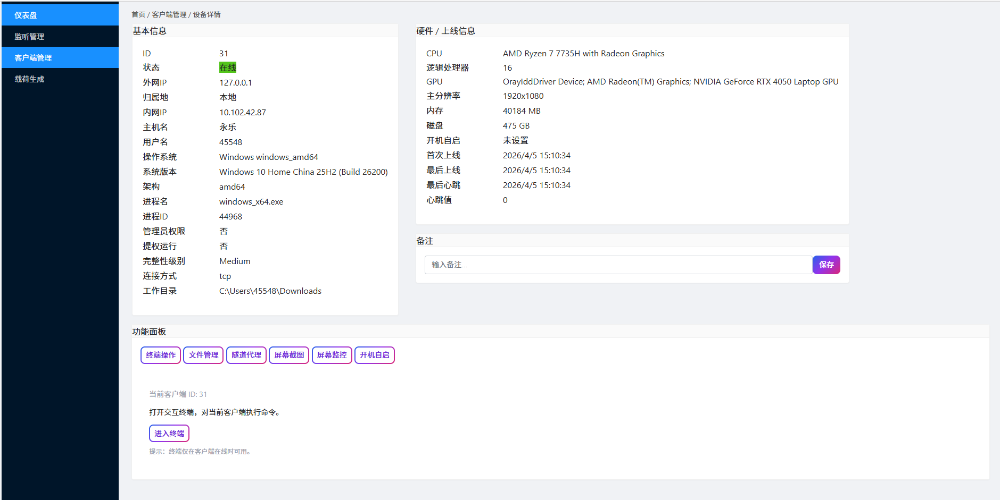

- **Basic / Hardware / Session info**: OS version, privilege, CPU/GPU/memory/disk, online/offline time.
- **Feature panel**: terminal, file manager, tunnel, screenshot, monitor, autostart.

### 8. Remote Terminal

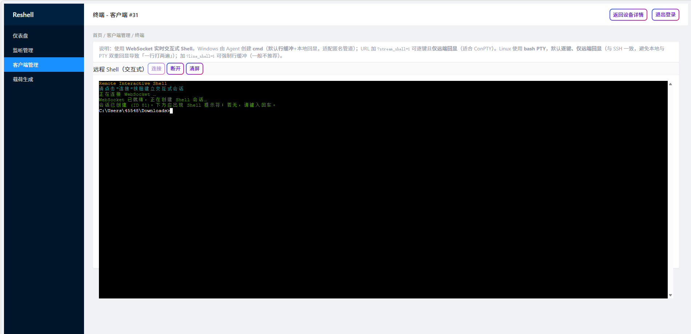

- WebSocket interactive shell (Windows `cmd` / Linux `bash` PTY), supports connect/disconnect/clear.

### 9. File Manager

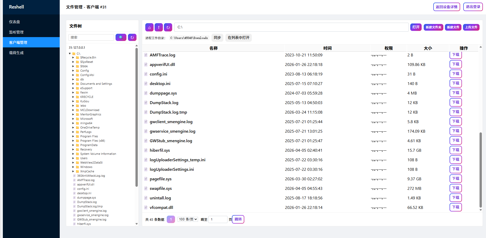

- Left file tree, right current directory list; supports enter directory, create, upload, download, and sync with working directory.

### 10. Tunnel Proxy (SOCKS5, etc.)

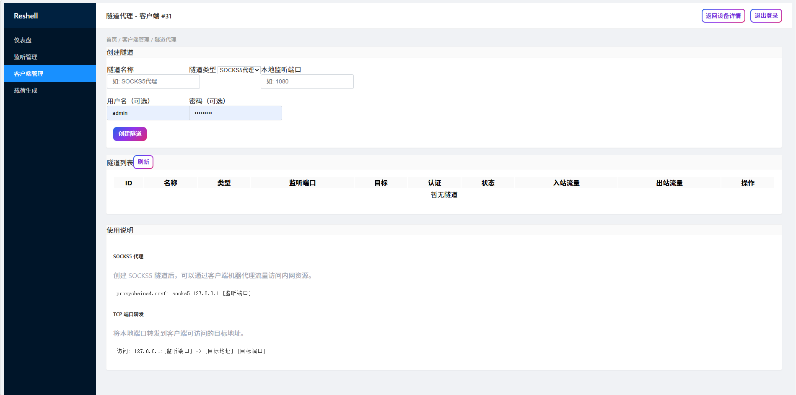

- **Create tunnel** with name, type (e.g. SOCKS5), local listen port, optional username/password.
- Tunnel list and usage notes are shown below.

### 11. Screenshot

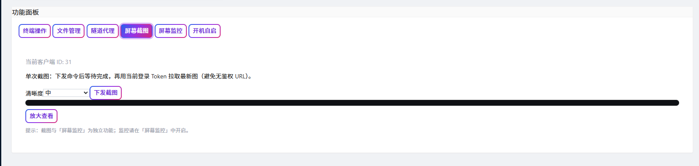

- Choose quality and send screenshot request; view or enlarge in page.

### 12. Screen Monitoring

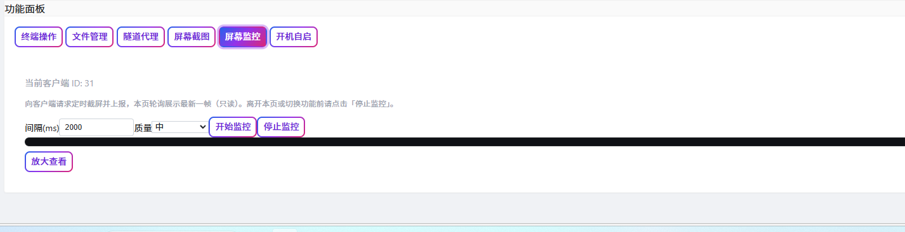

- Configure interval and quality, then start monitoring to poll latest frames; stop before leaving.

### 13. Autostart

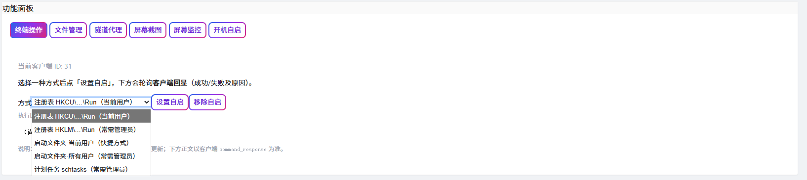

- Set or remove startup methods; actual effect depends on OS and client-side implementation (Linux has service-side logic; Windows follows current client code).

---

## Features (Aligned with Current Code)

### Server and Panel

- **Configuration**: `config.yaml` is loaded from current working directory; includes `server.addr`, `auth.login_password`, `auth.jwt_secret`, `database.path`, `logging.level`; optional **`server.public_host`**.
- **Auth**: login password + **JWT**; protected pages and `/api/*` require valid session.
- **Health check**: `GET /healthz`.
- **Dashboard**: listener/client stats, local CPU/memory/disk metrics (`gopsutil`).
- **Static assets**: `webdist/static` embedded into binary; no separate `templates/` deployment required.

### Listener (TCP)

- CRUD listeners in panel; start/stop maps to TCP `Listen`.
- **Connect commands**: backend generates multiple one-line/script URLs pointing to local HTTP stager/payload.

### Payload and Bootstrap

- **Payload generation**: patch stubs and output to **`data/generated/`**; current format is **`bin`**; targets: **Windows x64 / x86**, **Linux amd64**. Optional **`hide_console`** (Windows PE GUI subsystem).
- **Direct HTTP endpoints (no login required)**: `GET /payload/ps1/:id`, `GET /payload_exe/:id`, `GET /payload/{id}.elf`, `GET /payload/{id}.hta` (HTA uses same pull logic as ps1).

### Agent Capabilities (After Callback)

- **Terminal, file, process, screenshot/monitor, SOCKS5 tunnel**, etc. (depends on client and platform implementation).
- **Linux autostart**: systemd user unit, XDG autostart, crontab (names include `reshell-c2-agent`).  
  **Windows** panel actions `autostart_set` / `autostart_remove` are placeholders in current code.

### Others

- **`cmd/linuxagent`**: standalone Linux Agent entry (build with `GOOS=linux`), coexists with panel stub flow depending on deployment.
- **Database**: SQLite (default `data/c2.db`), initialized automatically on first run.

---

## Environment Requirements

- **Go 1.21+**
- Server: **Linux amd64** or **Windows**
- **Payloads** depend on stub files (see above); server-side generation does not require local g++.

---

## Build and Run Command Summary

```bash
# Development run (must be in directory containing config.yaml)
go mod download
go run ./cmd/server
```

```powershell
# Windows build example
go build -trimpath -ldflags="-s -w" -o c2-server.exe ./cmd/server
.\c2-server.exe
```

```powershell
# Cross-compile Linux amd64 server
.\scripts\build-server.ps1 -Target linux
# or manually:
$env:GOOS="linux"; $env:GOARCH="amd64"; $env:CGO_ENABLED="0"
go build -trimpath -ldflags="-s -w" -o c2-server-linux ./cmd/server
```

---

## Config Summary (`config.yaml`)

| Key | Meaning |
|----|------|
| `server.addr` | HTTP listen address, e.g. `:8080`, `127.0.0.1:8080` |
| `server.public_host` | Optional; target-reachable web host/IP (without port). Connect commands and embedded web address prefer this value to avoid `localhost` misuse. |
| `auth.login_password` | Panel login password |
| `auth.jwt_secret` | JWT secret (must be strong/random) |
| `database.path` | SQLite path |
| `logging.level` | e.g. `info`, `debug` |

Restart process after changes.

---

## Directory Structure (Brief)

| Path | Description |
|------|------|
| `cmd/server` | Server entry |
| `internal/server` | Routing, auth, pages, APIs |
| `internal/listener` | TCP listeners |
| `internal/agent`, `internal/channels`, `internal/websocket` | Connections and channels |
| `internal/payload` | Stub handling and C2EMBED1 patching |
| `internal/tunnel` | SOCKS5 |
| `client/native` | Native C++ agent source |
| `webdist` | Frontend templates/static assets (embed) |
| `data/stubs` | Payload templates (must include C2EMBED1) |
| `data/generated` | Generated payload output |
| `scripts` | Build scripts |

---

## Security and Compliance

- Change default password and JWT secret; protect config/database file permissions.
- Open only required firewall ports.
- Use only in **authorized** testing environments.

---

## Note

- This C2 does not provide raw `bin` shellcode output.  
  If needed for research, you may convert generated binaries with tools such as Donut, or implement instruction-level replacements yourself.

## License and Third-Party

- Project source (except third-party components) is released under **MIT**. See **`LICENSE`** in repo root.
- Terminal UI uses **xterm.js** (`webdist/static/xterm`) under its own license.
